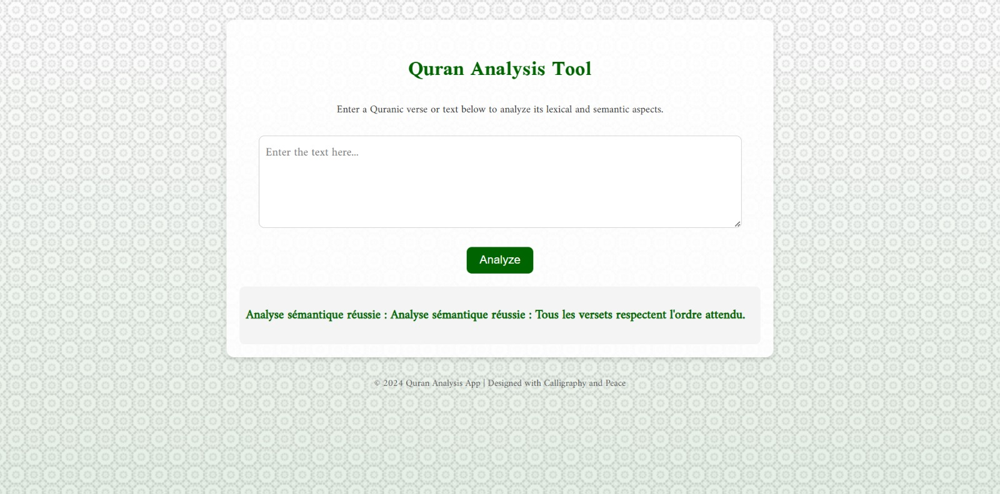

# 📜 Verses Compiler

A Python-based mini-compiler for validating and processing verses from Surah Al-Ikhlass in the Holy Quran. This application uses PLY (Python Lex-Yacc) to perform lexical, syntactic, and semantic analysis of Quranic verses in both Arabic script and phonetic transcription.

## ✨ Features

- 🌐 **Dual Transcription Support**: Process verses in both Arabic script and Latin-based phonetic transcription  
- 🔤 **Lexical Analysis**: Verify each word against the authentic text of Surah Al-Ikhlass  
- 🧠 **Syntactic Validation**: Ensure correct word order and structure according to the original verses  
- 📖 **Semantic Checking**: Validate that the meaning of the input matches the authentic verses  
- 💻 **User-Friendly Interface**: Simple command-line interface for verse input and validation  
- 🐞 **Detailed Error Reporting**: Specific feedback on lexical, syntactic, or semantic errors  

## ⚙️ Tech Stack

- 🐍 **Language**: Python 3.7+  
- 🔧 **Parsing Library**: PLY (Python Lex-Yacc)  
- 🧹 **Text Processing**: Regular expressions and custom tokenizers  
- 🧪 **Testing Framework**: Pytest  

### 📝 Arabic transcript interface
<p align="center">
  
</p>
<p align="center"><em>Validation of verses in Arabic script with detailed feedback</em></p>

### 📝 Phonetic transcript interface
<p align="center">
  
</p>
<p align="center"><em>Validation of verses in Arabic script with detailed feedback</em></p>

## 📦 Installation & Setup

### 📝 Prerequisites
- 🐍 Python 3.7 or higher  
- 📦 pip (Python package installer)  

### ⚙️ Setting Up the Environment
```bash
# Clone the repository
git clone https://github.com/yourusername/al-ikhlass-compiler.git
```
# Navigate to project directory
cd al-ikhlass-compiler

# Create and activate virtual environment (optional but recommended)
python -m venv venv
source venv/bin/activate  # On Windows: venv\Scripts\activate

# Install dependencies
pip install -r requirements.txt
